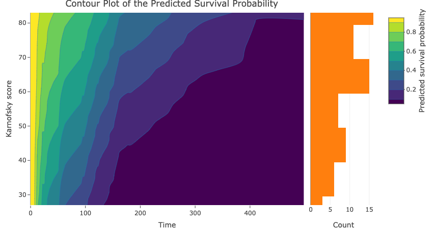
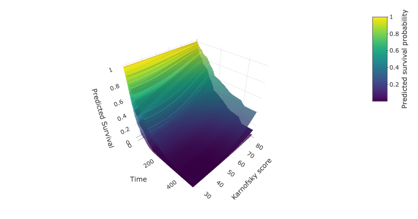

The Shiny app has accommodated several survival models, including the Cox model, the spline model, the generalized Gamma AFT model, the stable generalized Gamma AFT model, the Weibull AFT model, the log-logistic  AFT model, and the log-Normal AFT model. The number of knots in the spline model is set to be 4. For parametric AFT models, covariates are placed on the “location'' parameter of the distribution, typically the "scale" or "rate" parameter, through a linear model, or a log-linear model if this parameter must be positive.

## Cox model example

This Veterans’ Administration Lung Cancer dataset is a classic survival analysis dataset imported from the R package "survival". For the purpose of illustration, we only keep observations using the standard treatment. The continuous covariate Karnofsky performance score (100=good) is a strong predictor of the survival result. There are 69 samples in this example dataset and the event times range from 3 to 553 days with a median of 97.

Here is the result for the veterans’ administration lung cancer dataset.

## Interval censored data

The Cox model can handle interval-censored data.

## Notice on the confidence interval

We provide 95% pointwise confidence interval for the predicted survival curves at 5 quantiles of the continuous covariate.

## Reference

Cox, D. (1972). Regression models and life-tables. Journal of the Royal Statistical Society. Series B (Methodological), 34(2), 187-220.  [www.jstor.org/stable/2985181](www.jstor.org/stable/2985181)

Breslow, N. (1975). Analysis of survival data under the proportional hazards model. International Statistical Review / Revue Internationale De Statistique, 43(1), 45-57. doi:10.2307/1402659

Therneau, T. (2020). A package for survival analysis in R. R package version
3.2-3, [https://CRAN.R-project.org/package=survival](https://CRAN.R-project.org/package=survival)

Holst K. K., Scheike, T. H. and Hjelmborg J. B.  (2016). The Liability Threshold Model for Censored Twin Data. Computational Statistics and Data Analysis 93, pp. 324-335. doi: 10.1016/j.csda.2015.01.014

Scheike, T. H., Holst K. K. and Hjelmborg J. B. (2014). Estimating heritability for cause-specific mortality based on twin studies. Lifetime Data Analysis 20 (2), pp. 210-233. doi: 10.1007/s10985-013-9244-x

Jackson, C. (2016). flexsurv: A Platform for Parametric Survival Modeling in R. Journal of Statistical Software, 70(8), 1-33. doi:10.18637/jss.v070.i08

Cox, C. (2008). The generalized \(F\) distribution: An umbrella for parametric survival analysis. Statistics in Medicine 27:4301-4312.

Cox, C., Chu, H., Schneider, M. F., and Munoz, A. (2007). Parametric survival analysis and taxonomy of hazard functions for the generalized gamma distribution. Statistics in Medicine 26:4252-4374

Jackson, C. H., Sharples, L. D., and Thompson, S. G. (2010). Survival models in health economic evaluations: balancing fit and parsimony to improve prediction. International Journal of Biostatistics 6(1):Article 34.

Nelson, C. P., Lambert, P. C., Squire, I. B., and Jones, D. R. (2007). Flexible parametric models for relative survival, with application in coronary heart disease. Statistics in medicine, 26(30), 5486-5498.

Royston, P. and Parmar, M. (2002). Flexible parametric proportional-hazards and proportional-odds models for censored survival data, with application to prognostic modeling and estimation of treatment effects. Statistics in Medicine 21(1):2175-2197.

Karnofsky, D. A. (1949). The clinical evaluation of chemotherapeutic agents in cancer. Evaluation of Chemotherapeutic Agents 191–205.
