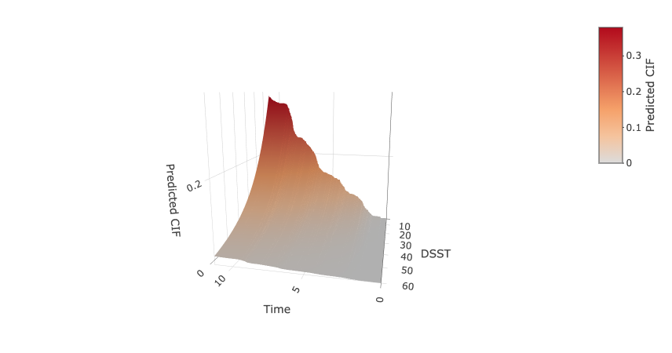

## Competing risks example 

The PAQUID dataset is from a study exploring functional and cerebral aging with 2561 subjects. The covariate DSST stands for Digit Symbol Substitution Score Test, which ranges from 0 to 70 with a median of 35. 

Here is the result for the PAQUID dataset.

## Data format

We use the standard format for competing risks in this app, i.e., 0 for censoring, 1 for events of primary interest, and 2 for other types of events. For data with interval censoring, when the event indicator is 0, the upper limit of the observation time interval is ignored; when the exact time of an event is known, users need to add a small number to the upper limit of the observation time interval to avoid having the lower and upper interval equal. 

## Reference

Fine, J. P. and Gray, R. J.(1999). A proportional hazards model for the subdistribution of a competing risk, Journal of the American Statistical Association, 94:446, 496-509, DOI: 10.1080/01621459.1999.10474144

Breslow, N. (1975). Analysis of survival data under the proportional hazards model. International Statistical Review / Revue Internationale De Statistique, 43(1), 45-57. doi:10.2307/1402659

Gerds, T. A. and Ozenne, B. (2020). riskRegression: risk regression models and prediction scores for survival analysis with competing risks. R package version 2020.02.05.
[https://CRAN.R-project.org/package=riskRegression](https://CRAN.R-project.org/package=riskRegression)

Park, J., Bkoyannis, G., and Yiannoutsos, C. T. (2019). Semiparametric competing risks regression under interval censoring using the R package intccr. Computer Methods and Programs in Biomedicine, 173, 167-176. [https://doi.org/10.1016/j.cmpb.2019.03.002](https://doi.org/10.1016/j.cmpb.2019.03.002)

Dartigues, J.-F., Gagnon, M., Barberger-Gateau, P., Letenneur, L., Commenges, D., Sauvel, C., Michel, P., and Salamon, R. (1992). The Paquid epidemiological program on brain ageing. Neuroepidemiology 11 (Suppl. 1), 14–18.