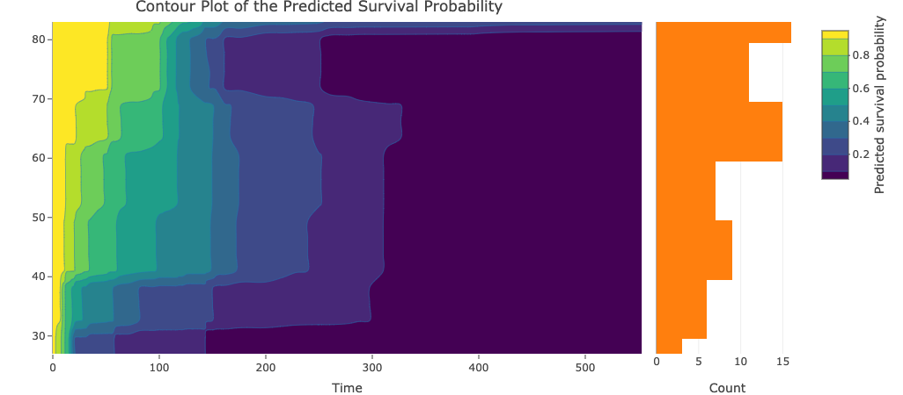
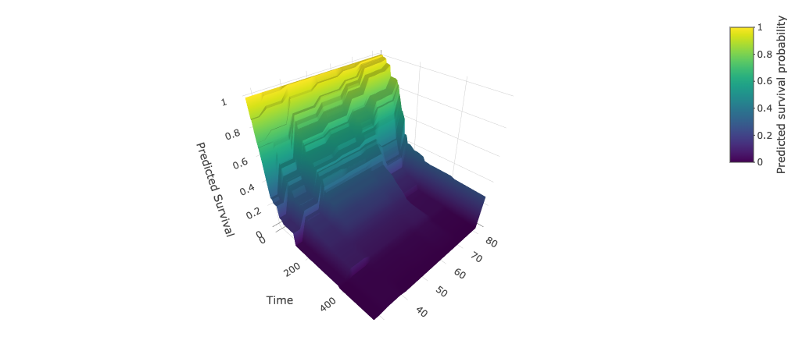

The shiny app can also handle random survival forest model. Users can specify the number of trees used (default is 500) in our app. 

Here are the results for the Veterans’ Administration lung cancer dataset using random survival forest. As shown in the contour plot, the relationship between the Karnofsky score and hazard is not monotonic.

## Reference

Ishwaran H. and Kogalur U.B. (2023). Fast Unified Random Forests for Survival, Regression, and Classification (RF-SRC), R package version 3.2.2.

Ishwaran H. and Kogalur U.B. (2007). Random survival forests for R. R News 7(2), 25--31.

Ishwaran H., Kogalur U.B., Blackstone E.H. and Lauer M.S. (2008). Random survival forests. Annals of Applied Statistics. 2(3), 841--860.
