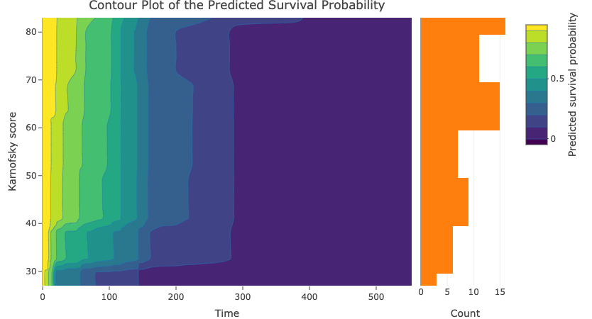
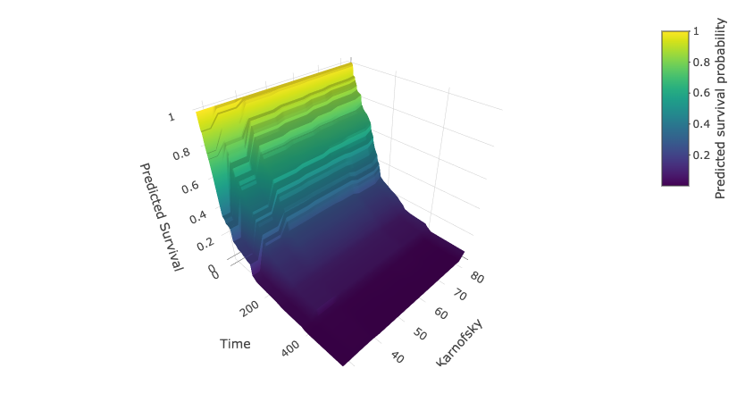

Here we reuse the veteran dataset with random survival forests model. We set the age at 65 and the time between diagnosis and start of the study (in month) at 10, and plot the effect of Karnofsky score on survival. As expected, higher Karnofsky score predicts better survival.

## Reference

Ishwaran H. and Kogalur U.B. (2023). Fast Unified Random Forests for Survival, Regression, and Classification (RF-SRC), R package version 3.2.2.

Ishwaran H. and Kogalur U.B. (2007). Random survival forests for R. R News 7(2), 25--31.

Ishwaran H., Kogalur U.B., Blackstone E.H. and Lauer M.S. (2008). Random survival forests. Annals of Applied Statistics. 2(3), 841--860.

Kalbfleisch, J. D. and Prentice, R. A. (2011). The statistical analysis of failure time data. New York: Wiley
