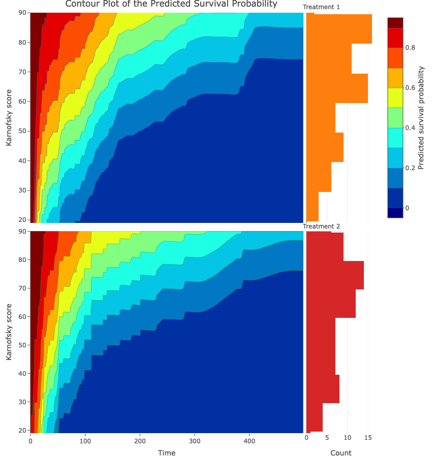
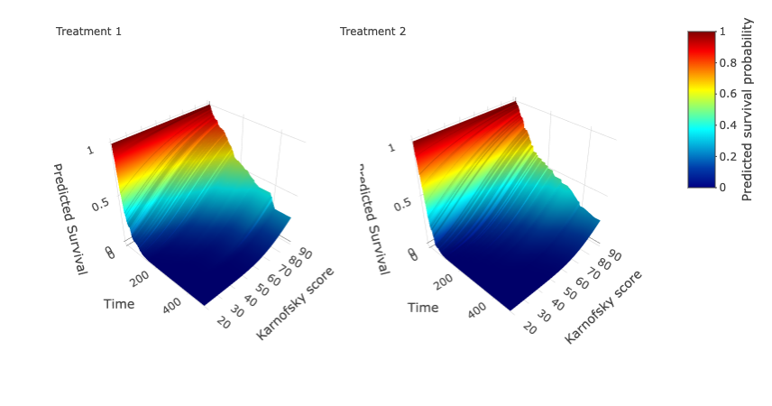

The Shiny app allows users to run stratified Cox model based on one categorical covariate. It will generate predicted survival contour plot for each stratum separately.

## Stratified Cox model example

In the example dataset, we use the full veteran data set, which contains 69 patients using the standard treatment (median event time 97, 7.2% censoring) and 68 patients using the test treatment (median event time 52.5, 5.9% censoring). The continuous covariate is still Karnofsky performance score. Results are shown by stratum. 

## Reference

Kalbfleisch, J. D. and Prentice, R. A. (2011). The statistical analysis of failure time data. New York: Wiley

Karnofsky, D. A. (1949). The clinical evaluation of chemotherapeutic agents in cancer. Evaluation of Chemotherapeutic Agents 191–205.